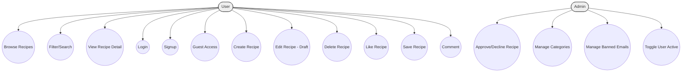

# PU “Paisii Hilendarski” (Plovdiv)
## Faculty of Mathematics and Informatics

# FoodieGram: A Modern Web Application for Community Recipe Sharing

## Thesis-Style Documentation

Student: <Your Name Here>
Supervisor: <Supervisor Name Here>
Program: <Program Name>
Date: <Month Year>


---

## Abstract
FoodieGram is a full-stack web application that enables users to register, authenticate, and share culinary recipes with a vibrant community. The system includes a role-based access model with standard users and administrators, offering recipe creation, editing (with draft moderation), liking, saving, filtering, pagination, and commenting features. Administrators can approve or decline pending recipes, manage categories, deactivate/activate users, and ban problematic email addresses. The application employs a modern frontend stack (React, Vite, TypeScript, Redux Toolkit, React-Bootstrap) and a robust backend (Node.js, Express, TypeScript) connected to MongoDB via Mongoose. JWT-based authentication secures protected endpoints while multer supports media uploads. 

This documentation presents a comprehensive academic exposition suitable for undergraduate study at PU “Paisii Hilendarski.” It covers problem motivation, requirements, architecture, database design, implementation details, quality practices, and evaluation. The document emphasizes clear system boundaries, modular design, security considerations aligned with OWASP guidelines, and maintainability. It includes diagrams (ERD, class, sequence, and flow), tables of API endpoints, and test case samples, with placeholders for future screenshots. The outcome is a cohesive guide to the structure, rationale, and operation of FoodieGram, highlighting lessons learned and pathways for future improvements.

Keywords: web application, recipes, React, Node.js, Express, MongoDB, JWT, Mongoose, Redux Toolkit, TypeScript, OWASP


---

## Acknowledgments
The author thanks the supervising faculty at PU “Paisii Hilendarski,” peers who provided feedback during development, and the open-source community whose tools and documentation enabled rapid and reliable implementation.


---

## Table of Contents
- [List of Figures](#list-of-figures)
- [List of Tables](#list-of-tables)
- [1. Introduction](#1-introduction)
  - [1.1 Problem Statement & Motivation](#11-problem-statement--motivation)
  - [1.2 Purpose, Scope, and Limitations](#12-purpose-scope-and-limitations)
  - [1.3 Target Users & Stakeholders](#13-target-users--stakeholders)
  - [1.4 Objectives and Success Criteria](#14-objectives-and-success-criteria)
- [2. Technologies Used](#2-technologies-used)
  - [2.1 Frontend](#21-frontend)
  - [2.2 Backend](#22-backend)
  - [2.3 Database](#23-database)
  - [2.4 Frameworks & Libraries](#24-frameworks--libraries)
  - [2.5 Development Tooling](#25-development-tooling)
  - [2.6 Hosting/Deployment Context](#26-hostingdeployment-context)
- [3. Methodology](#3-methodology)
  - [3.1 Process Model and Rationale](#31-process-model-and-rationale)
  - [3.2 Iterations, Backlog, and Milestones](#32-iterations-backlog-and-milestones)
  - [3.3 Collaboration and Version Control Workflow](#33-collaboration-and-version-control-workflow)
  - [3.4 Quality Practices](#34-quality-practices)
- [4. System Analysis & Requirements](#4-system-analysis--requirements)
  - [4.1 Functional Requirements (FRs)](#41-functional-requirements-frs)
  - [4.2 Non-Functional Requirements (NFRs)](#42-non-functional-requirements-nfrs)
  - [4.3 Use Cases](#43-use-cases)
- [5. Database Design](#5-database-design)
  - [5.1 Conceptual Model and ER Diagram](#51-conceptual-model-and-erd)
  - [5.2 Logical Schema and Constraints](#52-logical-schema-and-constraints)
  - [5.3 Table Catalog](#53-table-catalog)
  - [5.4 Example Queries](#54-example-queries)
- [6. System Design](#6-system-design)
  - [6.1 Architecture Overview](#61-architecture-overview)
  - [6.2 Class Diagram (Backend Modules)](#62-class-diagram-backend-modules)
  - [6.3 Sequence Diagrams](#63-sequence-diagrams)
  - [6.4 Flowcharts (Core Processes)](#64-flowcharts-core-processes)
  - [6.5 API Surface](#65-api-surface)
  - [6.6 Security Considerations](#66-security-considerations)
- [7. Implementation](#7-implementation)
  - [7.1 UI/UX Overview](#71-uiux-overview)
  - [7.2 Key Backend Components](#72-key-backend-components)
  - [7.3 Integration (Frontend–Backend)](#73-integration-frontendbackend)
  - [7.4 Configuration and Environment](#74-configuration-and-environment)
- [8. Testing & Evaluation](#8-testing--evaluation)
  - [8.1 Test Strategy](#81-test-strategy)
  - [8.2 Test Case Samples](#82-test-case-samples)
  - [8.3 Performance Notes](#83-performance-notes)
  - [8.4 User Evaluation](#84-user-evaluation)
- [9. Results & Discussion](#9-results--discussion)
- [10. Conclusion & Future Work](#10-conclusion--future-work)
- [11. References / Library](#11-references--library)
- [12. Appendices](#12-appendices)


---

## List of Figures
- Figure 3.1: Project Roadmap (Iterations and Milestones)
- Figure 4.1: Use Case Diagram – Actors and Use Cases
- Figure 5.1: ER Diagram – Conceptual Data Model
- Figure 6.1: Layered Architecture – Client–Server View
- Figure 6.2: Class Diagram – Backend Modules and Relationships
- Figure 6.3: Sequence Diagram – User Registration
- Figure 6.4: Sequence Diagram – User Login
- Figure 6.5: Sequence Diagram – Admin Approves Recipe
- Figure 6.6: Flowchart – JWT Authentication Flow
- Figure 6.7: Flowchart – Error Handling Flow

## List of Tables
- Table 4.1: Functional Requirements
- Table 4.2: Non-Functional Requirements
- Table 5.1: Collection Schema — Users
- Table 5.2: Collection Schema — Recipes
- Table 5.3: Collection Schema — Categories
- Table 5.4: Collection Schema — BannedEmails
- Table 6.1: API Endpoints Summary
- Table 8.1: Sample Test Cases


---

## 1. Introduction
### 1.1 Problem Statement & Motivation
Recipe sharing is a popular and valuable social activity. However, communities often lack platforms that combine ease of content creation, rich metadata (ingredients, steps, nutrition), moderation workflows, and social interactions such as likes, saves, and comments. FoodieGram addresses this gap with a modern, mobile-friendly web application, focusing on security, usability, and maintainability.

### 1.2 Purpose, Scope, and Limitations
- Purpose: Provide a community platform for authenticated users to create and manage recipes, and for administrators to moderate content and manage categories and users.
- Scope: Web application accessible via browser; backend REST API; user registration/login required for most functionality.
- Limitations: No native/mobile app; no local install steps provided here; external registration-only usage; simplified rating model; limited analytics.

### 1.3 Target Users & Stakeholders
- End Users: Cooking enthusiasts who want to publish, explore, save, like, and comment on recipes.
- Administrators: Moderators responsible for approving/declining recipes, managing categories, handling banned emails, and toggling user activity.
- Stakeholders: Faculty (academic evaluation), developers (maintainers), and hosting providers.

### 1.4 Objectives and Success Criteria
- Provide intuitive recipe creation and browsing with filters and pagination.
- Ensure secure JWT-based authentication and role-based authorization.
- Enable moderation workflows and category management.
- Achieve maintainable codebase with clear separation of concerns and typed interfaces.
- Success measured by functional completeness, reliability, and user satisfaction.


---

## 2. Technologies Used
This section introduces each technology, why it was chosen, how it is used in FoodieGram, and alternatives considered. Citations are provided for official documentation [1–15].

### 2.1 Frontend
- React (TypeScript): Declarative UI library for building component-based interfaces. Chosen for ecosystem maturity and excellent developer experience. Used for pages, components, and state management via Redux Toolkit. Alternatives: Vue, Angular.
- Vite: Fast dev server and build tool offering instant HMR and optimized bundles. Alternatives: CRA, Webpack.
- Redux Toolkit: Streamlined Redux with slices and immutable state updates; used for `authSlice` and `recipeSlice`. Alternatives: Zustand, MobX, React Query (for server state).
- React-Bootstrap: UI components for consistent styling and responsive layouts. Alternatives: MUI, Chakra UI, Tailwind CSS.
- Axios: Promise-based HTTP client with interceptors (JWT injection). Alternatives: Fetch API, ky.

### 2.2 Backend
- Node.js + Express: Lightweight, performant server for REST APIs. Alternatives: NestJS, Koa, Fastify.
- TypeScript: Static typing to improve reliability and maintainability across controllers, middleware, and models.
- Multer: Middleware for handling multipart/form-data and recipe image uploads.
- jsonwebtoken (JWT): Token-based authentication for stateless session management.
- bcryptjs: Secure password hashing for stored credentials.

### 2.3 Database
- MongoDB with Mongoose ODM: Schema-based modeling; flexible document structures suit nested recipe content (ingredients, steps, comments). Alternatives: PostgreSQL with Prisma, MySQL, SQLite.

### 2.4 Frameworks & Libraries
- Mongoose: Schemas for `User`, `Recipe`, `Category`, `BannedEmail`, with validation and indexing.
- CORS middleware: Enable cross-origin requests from the frontend.

### 2.5 Development Tooling
- Git/GitHub: Version control and collaboration.
- IDE: VS Code (typical) with TypeScript tooling.
- API Client: Postman/Thunder Client for manual endpoint testing.
- Linters/Formatters: ESLint (frontend), Prettier (optionally) for style consistency.
- Testing Tools: Jest/React Testing Library (recommended for future work).

### 2.6 Hosting/Deployment Context
- Backend can be hosted on Node-compatible platforms (e.g., Render, Railway, Heroku). MongoDB Atlas for database hosting. Frontend deployable to static hosts (e.g., Vercel, Netlify). CI/CD optional via GitHub Actions.


---

## 3. Methodology
### 3.1 Process Model and Rationale
An Agile/Scrum approach was selected for iterative delivery, rapid feedback, and evolving requirements. Short sprints (1–2 weeks) enable frequent review and prioritization.

### 3.2 Iterations, Backlog, and Milestones
Roadmap highlights: initial authentication, recipe CRUD, moderation, categories, and UX refinement.

Figure 3.1: Project Roadmap (Iterations and Milestones)


### 3.3 Collaboration and Version Control Workflow
- Trunk-based or GitFlow branching; pull requests for code review; semantic commit messages.
- Issues and project boards for backlog and sprint planning.

### 3.4 Quality Practices
- Code reviews focusing on security, correctness, readability.
- Static analysis via TypeScript and ESLint; manual testing via Postman and UI walkthroughs.
- CI concepts: automated lint and build checks before merges (recommended).


---

## 4. System Analysis & Requirements
### 4.1 Functional Requirements (FRs)
Table 4.1: Functional Requirements

| ID | Requirement |
|----|-------------|
| FR-1 | User registration with email, username, password |
| FR-2 | User login with JWT issuance |
| FR-3 | Guest access with limited capabilities |
| FR-4 | View recipe list with filters, search, sorting, pagination |
| FR-5 | View recipe detail |
| FR-6 | Create recipe with image upload |
| FR-7 | Edit recipe as draft (pending approval) |
| FR-8 | Delete own recipe |
| FR-9 | Like and save recipes (toggle) |
| FR-10 | Comment on recipes |
| FR-11 | Admin approve/decline pending recipes |
| FR-12 | Admin manage categories (CRUD) |
| FR-13 | Admin list users and toggle active state |
| FR-14 | Admin manage banned emails |

### 4.2 Non-Functional Requirements (NFRs)
Table 4.2: Non-Functional Requirements

| ID | Requirement |
|----|-------------|
| NFR-1 | Security: bcrypt password hashing, JWT auth, role checks |
| NFR-2 | Reliability: predictable error handling, validation |
| NFR-3 | Performance: paginated lists, indexed fields |
| NFR-4 | Usability: responsive UI, clear feedback |
| NFR-5 | Accessibility: semantic HTML, keyboard navigability (planned) |
| NFR-6 | Maintainability: TypeScript, modular controllers and models |
| NFR-7 | Scalability: stateless API, cloud database |

### 4.3 Use Cases
Figure 4.1: Use Case Diagram – Actors and Use Cases


Use Case Descriptions (examples):
- UC_Login: User submits credentials; system validates and returns JWT on success; otherwise error.
- UC_Create: Authenticated user creates a recipe with metadata and image; recipe enters pending status for moderation.
- UC_Approve: Admin reviews pending recipes; may approve (publishes draft) or decline with reason.


---

## 5. Database Design
### 5.1 Conceptual Model and ERD
FoodieGram uses MongoDB with a pragmatic mix of denormalization (embedding author info and comments in recipes) and referencing via stable `author.id` string.

Figure 5.1: ER Diagram – Conceptual Data Model


### 5.2 Logical Schema and Constraints
- Users: unique `email`, `role ∈ {user, admin}`, `active` boolean.
- Recipes: unique `id` string (separate from Mongo `_id`), optional `draft` object, `status ∈ {pending, approved, declined}`.
- Categories: unique `name` string.
- BannedEmails: unique `email` string.

### 5.3 Table Catalog
Table 5.1: Collection Schema — Users

| Field | Type | Constraints | Description |
|-------|------|-------------|-------------|
| username | String | required | Display name |
| email | String | required, unique | Login identifier |
| password | String | required | Bcrypt hash |
| bio | String | optional | Profile bio |
| location | String | optional | City/Country |
| joinedAt | String | optional | ISO timestamp |
| avatar | String | optional | Avatar URL |
| role | String | enum[user,admin], default user | Access level |
| active | Boolean | default true | Account status |

Table 5.2: Collection Schema — Recipes

| Field | Type | Constraints | Description |
|-------|------|-------------|-------------|
| id | String | unique, indexed | Public recipe identifier |
| title | String | required | Recipe title |
| description | String | required | Summary/description |
| image | String | optional | Image path/URL |
| author | Object | required | {id, name, avatar} denormalized |
| createdAt | String | required | ISO timestamp |
| updatedAt | String | required | ISO timestamp |
| cookingTime | Number | optional | Minutes |
| servings | Number | optional | Portion count |
| difficulty | String | optional | e.g., Easy/Medium/Hard |
| category | [String] | optional | Categories by name |
| ingredients | [Ingredient] | optional | Name, quantity, unit, notes |
| steps | [Step] | optional | Ordered instructions |
| tags | [String] | optional | Keywords |
| nutrition | Object | optional | Calories, protein, carbs, fat, fiber |
| rating | Number | default 0 | Computed from likes |
| reviewCount | Number | default 0 | Future extension |
| savedBy | [String] | optional | User IDs who saved |
| likes | Number | default 0 | Total likes |
| likedBy | [String] | optional | User IDs who liked |
| comments | [Comment] | optional | Embedded comments |
| status | String | enum[pending,approved,declined] | Moderation status |
| declineReason | String | optional | Reason on decline |
| draft | Object | optional | Pending edits prior to approval |

Table 5.3: Collection Schema — Categories

| Field | Type | Constraints | Description |
|-------|------|-------------|-------------|
| name | String | unique | Category name |

Table 5.4: Collection Schema — BannedEmails

| Field | Type | Constraints | Description |
|-------|------|-------------|-------------|
| email | String | unique | Banned email address |

[Screenshot Placeholder: DB Admin UI – tables overview]

[Screenshot Placeholder: Table rows – sample data]

### 5.4 Example Queries
- Registration uniqueness check: `UserModel.findOne({ email })`
- Recipe listing with filters: `RecipeModel.find(filter).sort(sortSpec).skip((page-1)*limit).limit(limit)`
- Toggle like: add/remove `userId` in `likedBy`, recompute `likes` and `rating`.


---

## 6. System Design
### 6.1 Architecture Overview
FoodieGram follows a client–server architecture. The frontend communicates with the backend via REST/JSON over HTTPS, attaching JWTs in the Authorization header. Static content and uploads are served by the backend under `/uploads`.

Figure 6.1: Layered Architecture – Client–Server View
```mermaid
flowchart TD
  subgraph Client[Frontend (React, Vite)]
    UI[Pages & Components]
    State[Redux Toolkit Store]
    HTTP[Axios HTTP Client]
  end

  subgraph Server[Backend (Express, TypeScript)]
    Routes[Routes]
    Controllers[Controllers]
    Middleware[Auth, Upload]
    Models[Mongoose Models]
    DB[MongoDB]
  end

  UI --> State
  UI --> HTTP
  HTTP --> Routes
  Routes --> Controllers
  Controllers --> Middleware
  Controllers --> Models
  Models --> DB
```

### 6.2 Class Diagram (Backend Modules)
Figure 6.2: Class Diagram – Backend Modules and Relationships


### 6.3 Sequence Diagrams
Figure 6.3: Sequence Diagram – User Registration


Figure 6.4: Sequence Diagram – User Login


Figure 6.5: Sequence Diagram – Admin Approves Recipe


### 6.4 Flowcharts (Core Processes)
Figure 6.6: Flowchart – JWT Authentication Flow


Figure 6.7: Flowchart – Error Handling Flow


### 6.5 API Surface
Table 6.1: API Endpoints Summary

| Method | Path | Auth | Description |
|--------|------|------|-------------|
| GET | / | Public | Health/welcome message |
| POST | /api/auth/signup | Public | Register new user |
| POST | /api/auth/login | Public | Authenticate and return JWT |
| POST | /api/auth/guest | Public | Guest session token |
| GET | /api/auth/me | Bearer | Get current user profile |
| PUT | /api/auth/me | Bearer | Update profile fields |
| GET | /api/auth/users | Admin | List users |
| PUT | /api/auth/users/:id/toggle-active | Admin | Toggle user active |
| GET | /api/auth/banned-emails | Admin | List banned emails |
| POST | /api/auth/banned-emails | Admin | Add/Upsert banned email |
| DELETE | /api/auth/banned-emails | Admin | Remove banned email |
| GET | /api/recipes | Bearer | List recipes (filters, pagination) |
| GET | /api/recipes/mine | Bearer | List my recipes |
| GET | /api/recipes/categories | Public | List categories |
| POST | /api/recipes/categories | Admin | Add category |
| PUT | /api/recipes/categories/:name | Admin | Rename category |
| DELETE | /api/recipes/categories/:name | Admin | Delete category |
| GET | /api/recipes/:id | Bearer | Get recipe by id |
| POST | /api/recipes | Bearer | Create recipe (multipart form) |
| PUT | /api/recipes/:id | Bearer | Update recipe as draft |
| DELETE | /api/recipes/:id | Bearer | Delete own recipe |
| PUT | /api/recipes/:id/like | Bearer | Toggle like |
| PUT | /api/recipes/:id/save | Bearer | Toggle save |
| POST | /api/recipes/:id/comments | Bearer | Add comment |
| PUT | /api/recipes/:id/status | Admin | Approve/Decline |

### 6.6 Security Considerations
- Passwords: Hashed with bcrypt (salted) before storage [9].
- Authentication: JWT tokens signed with strong secret; expiry enforced; Authorization header `Bearer <token>` [6].
- Authorization: Middleware checks `role === 'admin'` for privileged routes; guest restrictions enforced.
- Input Validation: Server-side checks on required fields, structured JSON parsing for arrays.
- File Uploads: Multer stores to `public/uploads`; filenames time-prefixed.
- OWASP: Protect against common risks (injection, broken auth, sensitive data exposure) with validation, least privilege, and secure defaults [16].


---

## 7. Implementation
### 7.1 UI/UX Overview
[Screenshot Placeholder: Landing/Home]
[Screenshot Placeholder: Registration]
[Screenshot Placeholder: Login]
[Screenshot Placeholder: Recipes List]
[Screenshot Placeholder: Recipe Detail]
[Screenshot Placeholder: Add Recipe]
[Screenshot Placeholder: Edit Recipe]
[Screenshot Placeholder: Profile]
[Screenshot Placeholder: Admin – Pending]
[Screenshot Placeholder: Admin – Categories]
[Screenshot Placeholder: Admin – Users]

### 7.2 Key Backend Components
- Controllers: `authController.ts`, `recipeController.ts` implement business logic and responses.
- Middleware: `authMiddleware.ts` validates JWT; `uploadMiddleware.ts` handles images.
- Models: `User`, `Recipe`, `Category`, `BannedEmail` define schema and indexes.
- Seeding: On DB connect, admin user, categories, and sample recipes are seeded if absent.

Short illustrative snippet: JWT protection
```ts
// backend/src/middleware/authMiddleware.ts
export const protect = (req, res, next) => {
  const token = req.headers.authorization?.split(' ')[1];
  if (!token) return res.status(401).json({ message: 'Unauthorized' });
  try {
    const decoded = jwt.verify(token, JWT_SECRET);
    (req as any).userId = decoded.id;
    (req as any).userRole = decoded.role || 'user';
    (req as any).userGuest = decoded.guest === true;
    next();
  } catch {
    res.status(401).json({ message: 'Invalid token' });
  }
};
```

### 7.3 Integration (Frontend–Backend)
- Axios interceptor injects token from `localStorage`.
- Redux slices manage `auth` and `recipes` state; components dispatch thunks to fetch and mutate.
- Images under `/uploads` are rendered by prefixing with API base URL when needed.

### 7.4 Configuration and Environment
- Backend: `.env` with `MONGO_URI`, `JWT_SECRET`, `PORT` (defaults exist for dev).
- Frontend: `VITE_API_BASE_URL` for backend base URL.
- No secrets committed; environment variables supplied at deployment.


---

## 8. Testing & Evaluation
### 8.1 Test Strategy
- Unit Tests: Controllers and utils (recommended future work with Jest).
- Integration Tests: API endpoints via Supertest (future work).
- Manual/E2E: UI flows (signup, login, CRUD, admin moderation) validated with Postman and browser.

### 8.2 Test Case Samples
Table 8.1: Sample Test Cases

| ID | Title | Steps | Expected |
|----|-------|-------|----------|
| TC-1 | Successful signup | POST /auth/signup with valid data | 201 Created, user summary |
| TC-2 | Duplicate email | Signup with existing email | 400 Error |
| TC-3 | Login success | POST /auth/login valid creds | 200 + JWT |
| TC-4 | Login banned | POST /auth/login banned email | 403 Error |
| TC-5 | Create recipe | Auth + multipart form | 201 + pending recipe |
| TC-6 | Approve recipe | Admin PUT /recipes/:id/status | 200 + status=approved |

[Screenshot Placeholder: Test runner output / console logs]

### 8.3 Performance Notes
- Pagination limits (default 8–10 per page) keep responses small.
- Indexed fields (`Recipe.id`, unique keys) reduce lookup costs.

### 8.4 User Evaluation
- Informal feedback suggests intuitive flows; guest access aids exploration; admin tools streamline moderation.


---

## 9. Results & Discussion
- Achievements: Implemented secure JWT auth, CRUD with moderation, categories, and admin tools; responsive UI using React-Bootstrap; seeding for quick start.
- Limitations: Minimal analytics, simple rating derived from likes, no password reset flow, limited accessibility review.
- Challenges: Schema evolution with denormalized structures; ensuring consistent filtering and pagination; handling file uploads across environments.


---

## 10. Conclusion & Future Work
- Contributions: A maintainable full-stack recipe platform with moderation and role-based features.
- Future Work:
  - Scalability: Caching, CDN for images, horizontal scaling.
  - Search: Full-text search and faceted filters.
  - Accessibility: WCAG alignment and audits.
  - Mobile: PWA enhancements and offline support.
  - Roles: Editors/Moderators, richer notifications, social features.


---

## 11. References / Library
[1] React, “React Docs,” `https://react.dev/`.

[2] TypeScript, “TypeScript Handbook,” `https://www.typescriptlang.org/docs/`.

[3] Vite, “Vite Guide,” `https://vitejs.dev/guide/`.

[4] Redux Toolkit, “RTK Docs,” `https://redux-toolkit.js.org/`.

[5] React-Bootstrap, “Components,” `https://react-bootstrap.github.io/`.

[6] IETF, “RFC 6750: Bearer Token Usage,” `https://datatracker.ietf.org/doc/html/rfc6750`.

[7] Express, “Express Guide,” `https://expressjs.com/`.

[8] Mongoose, “Mongoose Docs,” `https://mongoosejs.com/`.

[9] bcrypt, “bcryptjs,” `https://www.npmjs.com/package/bcryptjs`.

[10] JWT, “jsonwebtoken,” `https://github.com/auth0/node-jsonwebtoken`.

[11] Multer, “Multer,” `https://github.com/expressjs/multer`.

[12] Axios, “Axios Guide,” `https://axios-http.com/`.

[13] MongoDB, “MongoDB Manual,” `https://www.mongodb.com/docs/`.

[14] OWASP, “Top 10,” `https://owasp.org/www-project-top-ten/`.

[15] ESLint, “ESLint,” `https://eslint.org/`.

[16] MDN, “CORS,” `https://developer.mozilla.org/docs/Web/HTTP/CORS`.

[17] MDN, “HTTP Status Codes,” `https://developer.mozilla.org/docs/Web/HTTP/Status`.

[18] GitHub Docs, “Actions,” `https://docs.github.com/actions`.

[19] Netlify Docs, “Deploy React,” `https://docs.netlify.com/`.

[20] Vercel Docs, “Deploy,” `https://vercel.com/docs`.


---

## 12. Appendices
### Appendix A: Additional Diagrams
[Screenshot Placeholder: Additional Architecture Diagram]

### Appendix B: Full API Examples
- Example: Create Recipe (multipart/form-data)
```
POST /api/recipes
Authorization: Bearer <token>
Content-Type: multipart/form-data

Fields:
- title, description, cookingTime, servings, difficulty
- category: JSON string array or comma-separated
- ingredients: JSON string array
- steps: JSON string array
- tags: JSON string array
- nutrition: JSON object
- image: file
```

### Appendix C: UI Flows
[Screenshot Placeholder: User Journey – From Login to Publishing]
